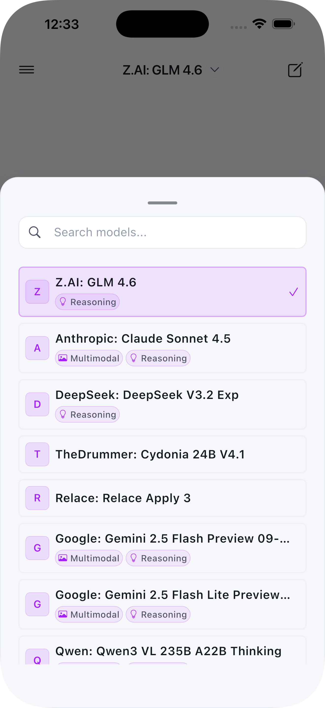
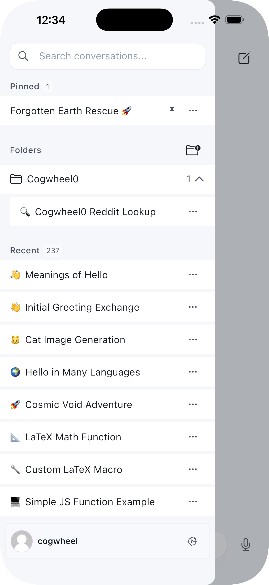
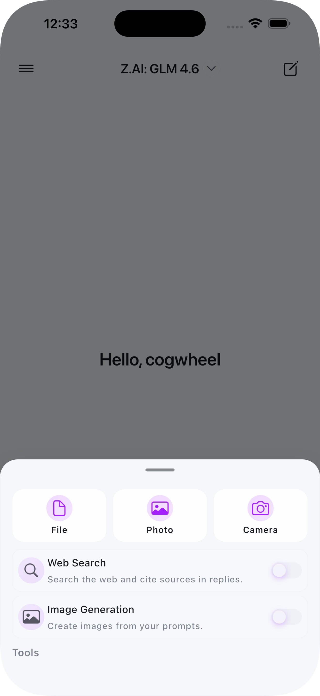
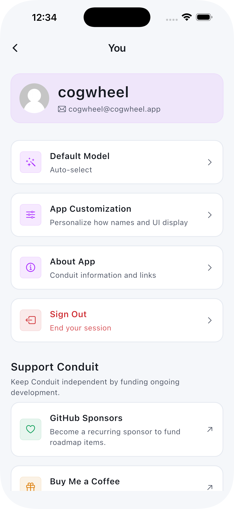

# JyotiGPT

<div align="center">


<a href="https://play.google.com/store/apps/details?id=app.y4shg.jyotigpt">

</a>
<a href="https://apps.apple.com/us/app/jyotigpt-open-webui-client/id6749840287">

</a>

</div>

<br>

<div align="center">

</div>

<br>

JyotiGPT is an open-source, cross-platform mobile application for Open-WebUI, providing a native mobile experience for interacting with your self-hosted AI infrastructure.

## Table of Contents

- [Features](#features)
- [Screenshots](#screenshots)
- [Requirements](#requirements)
- [Quickstart](#quickstart)
- [Installation](#installation)
- [Building for Release](#building-for-release)
- [Configuration](#configuration)
- [Localization (i18n)](#localization-i18n)
- [Compatibility](#compatibility)
- [Docs](#docs)
- [Architecture](#architecture)
- [Troubleshooting](#troubleshooting)
- [Security & Privacy](#security--privacy)
- [Contributing](#contributing)
- [License](#license)
- [Support](#support)

## Quickstart

```bash
git clone https://github.com/y4shg/jyotigpt && cd jyotigpt
flutter pub get
flutter pub run build_runner build --delete-conflicting-outputs
flutter run -d ios   # or: -d android
```

## Features

### Core Features
- **Real-time Chat**: Stream responses from AI models in real-time
- **Model Selection**: Choose from available models on your server
- **Conversation Management**: Create, search, and manage chat histories
- **Markdown Rendering**: Full markdown support with syntax highlighting
- **Theme Support**: Light, Dark, and System themes

### Advanced Features
- **Voice Input**: Use speech-to-text for hands-free interaction
- **File Uploads**: Support for images and documents (RAG)
- **Multi-modal Support**: Work with vision models
- **Secure Storage**: Credentials stored securely using platform keychains
- **Folder Management**: Organize conversations into folders; create, rename, move, and delete
 - **Tools (Function Calling)**: Invoke server-side tools exposed by Open‑WebUI, with result rendering

### Authentication
JyotiGPT supports multiple authentication flows when connecting to your Open‑WebUI:
- **Username + Password**: Sign in directly against servers that expose a login endpoint. Credentials are stored securely using platform keychains.
- **API Key**: Paste a server‑issued API token for stateless auth.
- **Custom Headers**: Add headers during login (e.g., `X-API-Key`, `Authorization`, `X-Org`, or self‑hosted SSO headers) that JyotiGPT will include on all HTTP/WebSocket requests (see [Endpoint Allowlist](#endpoint-allowlist-custom-auth) for reverse proxy whitelisting).

## Screenshots

| | | | |
| --- | --- | --- | --- |
|  |  |  |  |

## Requirements

- Flutter SDK 3.0.0 or higher
- Android 6.0 (API 23) or higher
- iOS 12.0 or higher
- A running Open-WebUI instance

## Installation

1. Clone the repository:
```bash
git clone https://github.com/yourusername/jyotigpt.git
cd jyotigpt
```

2. Install dependencies:
```bash
flutter pub get
```

3. Generate code:
```bash
flutter pub run build_runner build --delete-conflicting-outputs
```

4. Run the app:
```bash
# For iOS
flutter run -d ios

# For Android
flutter run -d android
```

## Building for Release

### Android
```bash
flutter build apk --release
# or for App Bundle
flutter build appbundle --release
```

### iOS
```bash
flutter build ios --release
```

## Configuration

### Android
The app requires the following permissions:
- Internet access
- Microphone (for voice input)
- Camera (for taking photos)
- Storage (for file selection)

### iOS
The app will request permissions for:
- Microphone access (voice input)
- Speech recognition
- Camera access
- Photo library access

## Localization (i18n)

See the dedicated documentation: [docs/localization.md](docs/localization.md)

## Compatibility

| JyotiGPT App | Open‑WebUI | Notes |
| --- | --- | --- |
| 1.x | 0.3.x+ | OpenAPI validation removed in 1.1+ (no bundled schema) |

## Docs

- Localization: `docs/localization.md`
- Architecture (planned): `docs/architecture.md`
- Theming (planned): `docs/theming.md`
- Release Process (planned): `docs/release.md`

## Architecture

The app follows a clean architecture pattern with:
- **Riverpod** for state management
- **Dio** for HTTP networking
- **WebSocket** for real-time streaming
- **Flutter Secure Storage** for credential management

### Project Structure
```
lib/
├── core/
│   ├── models/         # Data models
│   ├── services/       # API and storage services
│   ├── providers/      # Global state providers
│   └── utils/          # Utility functions
├── features/
│   ├── auth/           # Authentication feature
│   ├── chat/           # Chat interface feature
│   ├── server/         # Server connection feature
│   └── settings/       # Settings feature
└── shared/
    ├── theme/          # App theming
    ├── widgets/        # Shared widgets
    └── utils/          # Shared utilities
```

## Contributing

Contributions are welcome! Please feel free to submit a Pull Request.

Developer workflow:

```bash
flutter analyze
flutter pub run build_runner build --delete-conflicting-outputs
# flutter test  # add when tests are available
```

1. Fork the project
2. Create your feature branch (`git checkout -b feature/AmazingFeature`)
3. Commit your changes (`git commit -m 'Add some AmazingFeature'`)
4. Push to the branch (`git push origin feature/AmazingFeature`)
5. Open a Pull Request

## Troubleshooting

- iOS: ensure recent Xcode, run `cd ios && pod install`, set signing team in Xcode if building on device.
- Android: minSdk 23+, ensure correct Java and Gradle; if builds fail, try `flutter clean`.
- Codegen conflicts: `flutter pub run build_runner build --delete-conflicting-outputs`.

## Security & Privacy

- Credentials are stored using platform secure storage (Keychain/Keystore).
- No analytics or telemetry are collected.
- Network calls are only made to your configured Open‑WebUI server.

### Endpoint Allowlist (Custom Auth)

If you protect Open‑WebUI with SSO or a reverse proxy (Authlia, Authentik,
etc.), whitelist these path prefixes so JyotiGPT can complete login, sync, and
streaming flows. Paths are relative to your server base URL.

- `/health`
- `/api/*`

WebSocket connections use the Socket.IO handshake on `/ws/socket.io`. Ensure the
same headers (or allowlist rules) apply there as well.

## License

This project is licensed under the GPL3 License - see the LICENSE file for details.

## Acknowledgments

- Open-WebUI team for creating an amazing self-hosted AI interface
- Flutter team for the excellent mobile framework
- All contributors and users of JyotiGPT

## Support

For issues and feature requests, please use the [GitHub Issues](https://github.com/y4shg/jyotigpt/issues) page.
